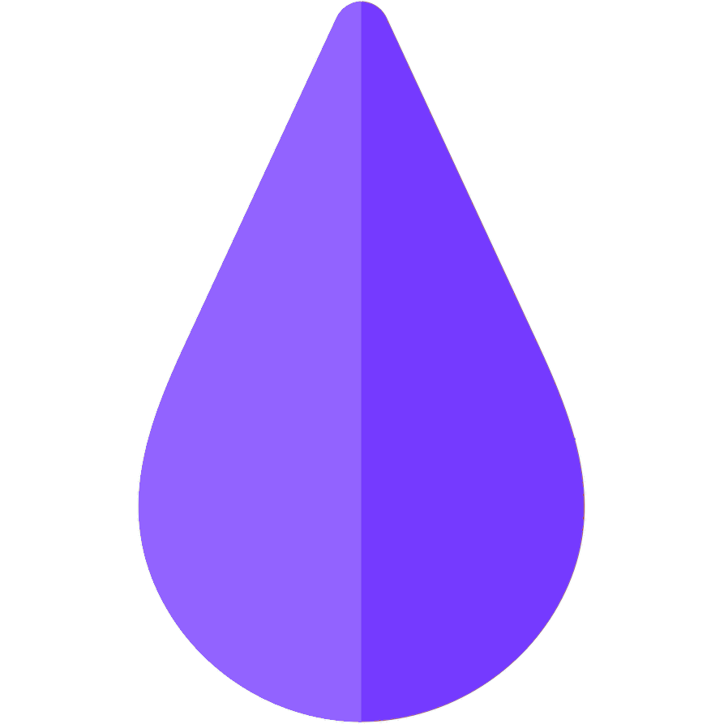

[![Contributors][contributors-shield]][contributors-url]
[![Forks][forks-shield]][forks-url]
[![Stargazers][stars-shield]][stars-url]
[![Issues][issues-shield]][issues-url]
[![MIT License][license-shield]][license-url]
[![LinkedIn][linkedin-shield]][linkedin-url]


<!-- PROJECT LOGO -->
<br />
<p align="center">
  <a href="https://github.com/j0shW/Pigment">
    
  </a>

  <h3 align="center">Pigment</h3>

  <p align="center">
    Compare paint colors between a variety of popular model paint brands.
    <br />
    <a href="https://github.com/j0shW/Pigment"><strong>Explore the docs »</strong></a>
    <br />
    <br />
    <a href="https://j0shW.github.io/Pigment">View Demo</a>
    ·
    <a href="https://github.com/j0shW/Pigment/issues">Report Bug</a>
    ·
    <a href="https://github.com/j0shW/Pigment/issues">Request Feature</a>
  </p>
</p>


<!-- TABLE OF CONTENTS -->
## Table of Contents

* [About the Project](#about-the-project)
  * [Built With](#built-with)
* [Getting Started](#getting-started)
  * [Prerequisites](#prerequisites)
  * [Installation](#installation)
* [Usage](#usage)
* [Roadmap](#roadmap)
* [Contributing](#contributing)
* [License](#license)
* [Contact](#contact)
* [Acknowledgements](#acknowledgements)


<!-- ABOUT THE PROJECT -->
## About The Project

[![Product Name Screen Shot][product-screenshot]](https://j0shW.github.io/Pigment/)

Pigment is a tool for **Miniature** and **Model** painters. It helps you find similar colors between paint brands.

Has your favorite color been discontinued? Did a tutorial call for a certain paint or brand that your local hobbby store doesn't carry? Is Citadel paint just too rich for your blood? 

Well now with **Pigment** you can find great alternative colors! You can search for a color and get matches immediately, so you can get back to painting instead of wasting your time fumbling with paint comparison spreadsheets.


### Built With

* [React](https://reactjs.org/)
* [Semantic UI](https://semantic-ui.com/)


<!-- GETTING STARTED -->
## Getting Started

To get a local copy up and running follow these simple steps.

### Prerequisites

Things you need to use the software and how to install them.
* npm
```sh
npm install npm@latest -g
```

### Installation
 
1. Clone the repo
```sh
git clone https:://github.com/j0shW/Pigment.git
```
2. Install NPM packages
```sh
npm install
```


<!-- USAGE EXAMPLES -->
## Usage

Find a specific color using the **search bar**, then similar colors from various brands will be shown on the screen. The closest match will be shown on the *left*, and the matches become *increasingly distant* to the *right*. 

Clicking the **filter button** will allow you to toggle *on or off* certain brands from being displayed in the match results. For example if your local hobby store doesn't carry Reaper brand products, you can disable it in the filter list and now you will only be shown products that the retailer carries.

There's also a **random button** if you just want to see pretty colors fill the screen    :smile:

<!--_For more examples, please refer to the [Documentation](https://example.com)_-->


<!-- ROADMAP -->
## Roadmap

See the [open issues](https://github.com/j0shW/Pigment/issues) for a list of proposed features (and known issues).


<!-- CONTRIBUTING -->
## Contributing

Contributions are what make the open source community such an amazing place to be learn, inspire, and create. Any contributions you make are **greatly appreciated**.

1. Fork the Project
2. Create your Feature Branch (`git checkout -b feature/AmazingFeature`)
3. Commit your Changes (`git commit -m 'Add some AmazingFeature'`)
4. Push to the Branch (`git push origin feature/AmazingFeature`)
5. Open a Pull Request


<!-- LICENSE -->
## License

Distributed under the MIT License. See `LICENSE` for more information.


<!-- CONTACT -->
## Contact

Josh Whitney - [@JoshJRWhitney](https://twitter.com/JoshJRWhitney) - joshjrwhitney@gmail.com

Project Link: [https://github.com/j0shW/Pigment](https://github.com/j0shW/Pigment)


<!-- ACKNOWLEDGEMENTS -->
## Acknowledgements

* [Delta-E Package](https://www.npmjs.com/package/delta-e)
* [Color-convert Package](https://www.npmjs.com/package/color-convert)
* [GitHub Pages](https://pages.github.com)


<!-- MARKDOWN LINKS & IMAGES -->
<!-- https://www.markdownguide.org/basic-syntax/#reference-style-links -->
[contributors-shield]: https://img.shields.io/github/contributors/j0shW/Pigment.svg?style=flat-square
[contributors-url]: https://github.com/j0shW/Pigment/graphs/contributors
[forks-shield]: https://img.shields.io/github/forks/j0shW/Pigment.svg?style=flat-square
[forks-url]: https://github.com/j0shW/Pigment/network/members
[stars-shield]: https://img.shields.io/github/stars/j0shW/Pigment.svg?style=flat-square
[stars-url]: https://github.com/j0shW/Pigment/stargazers
[issues-shield]: https://img.shields.io/github/issues/j0shW/Pigment.svg?style=flat-square
[issues-url]: https://github.com/j0shW/Pigment/issues
[license-shield]: https://img.shields.io/github/license/j0shW/Pigment.svg?style=flat-square
[license-url]: https://github.com/j0shW/Pigment/blob/master/LICENSE.txt
[linkedin-shield]: https://img.shields.io/badge/-LinkedIn-black.svg?style=flat-square&logo=linkedin&colorB=555
[linkedin-url]: https://www.linkedin.com/in/josh-whitney-1b2241b4/
[product-screenshot]: src/images/screenshot.png
